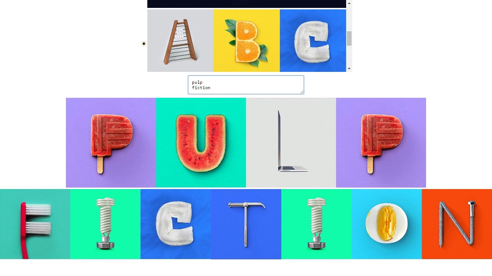

### T-Shirt constructor

### Надпись на футболку - необычным шрифтом

[Ссылка на GitHub Pages](https://likesatie.github.io/t-shirt-constructor/)

JavaScript application with React library that uses images as letters for sentence construction. Logic of the application divided on five separate scripts. First of it contains the array of objects with image links, second contains React class component of the font selector logic, third contains event listener of the font pick, fourth responsible for image select and the fifth for the textarea input data.

JavaScript-приложение с библиотекой React, которое использует изображения в качестве букв для построения предложений. Логика приложения разделена на пять отдельных скриптов. Первый из них содержит массив объектов со ссылками на изображения, второй - компонент класса React - логики выбора шрифта, третий - прослушиватель событий выбора шрифта, четвертый - ответственный за выбор изображения и пятый - за входные данные textarea.
